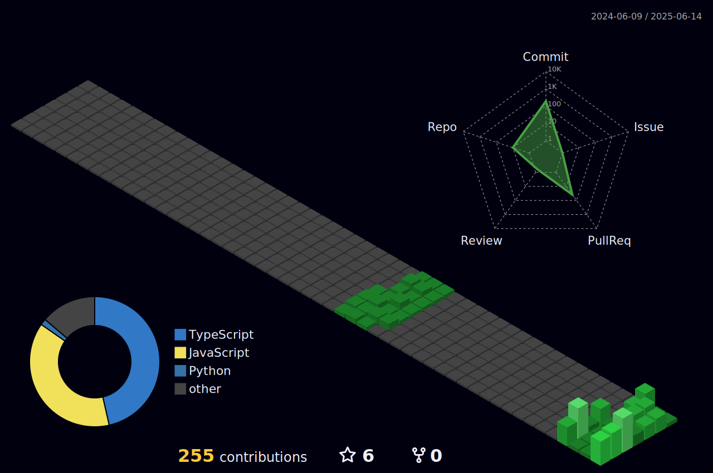

  A <strong>Full Stack Developer</strong> who is ✨ passionate ✨ about computer science.  
  I'm building projects or learning something new almost every day.  
  I love to explore new technologies and solve real-life problems.

 
 

  

 

  

<h3 align="center">
   <b>Skills</b>
</h3>

<b>Languages:</b> 

<b>Libraries / Frameworks:</b> 

<b>Databases:</b> 

<b>Applications & Tools:</b> 

  

<h3 align="center">
   <b>Github Stats</b>
</h3>

  

  

<!-- 

  

 -->

  

<h3 align="center" style="display: flex; justify-content: center; align-items: center; gap: 5px;">
   
  <b>Spotify Stats</b>
</h3>

  

  

<h3 align="center">Connect with me 🤝</h3>

  
  
  
  

<!--  -->
